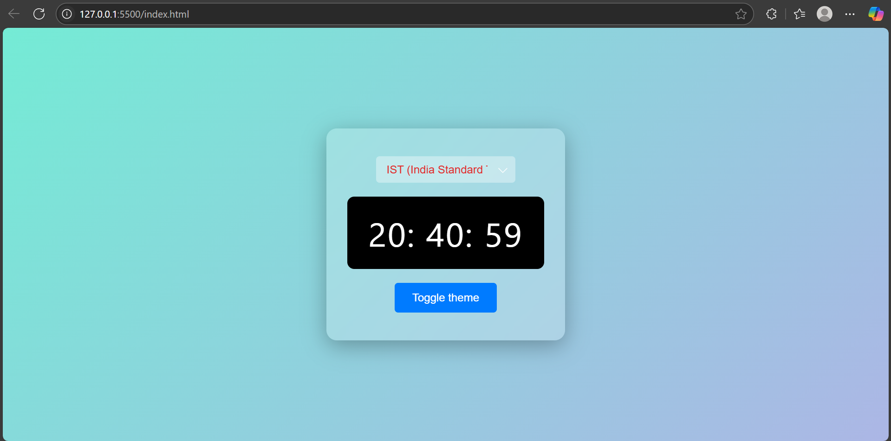
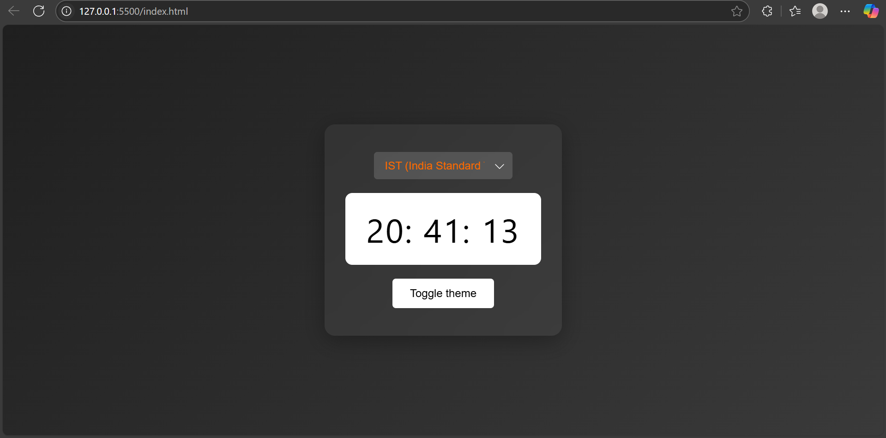

# 🌐 Digital Clock with Time Zone Selector & Dark Mode

A modern, responsive digital clock web app built using **HTML, CSS, and JavaScript**, featuring:

- Real-time updates ⏰  
- Multiple time zone support 🌍  
- Light/Dark theme toggle 🌗  
- Sleek UI with glassmorphism ✨  

---

## 🔥 Demo

> ⚡ [Live Demo on GitHub Pages](#) *((https://durgeshshukla18.github.io/digitalClock/))*

---

## 📸 Screenshots

### 🕒 Light Mode


### 🌑 Dark Mode


---

## 🧠 Features

✅ Real-time clock display  
✅ Select from important world time zones (IST, UTC, PST, EST, etc.)  
✅ Toggle between light and dark themes  
✅ Smooth glassmorphism design using CSS  
✅ Clean, maintainable codebase  

---

## 🚀 Tech Stack

| Tech           | Description                          |
|----------------|--------------------------------------|
| HTML5          | Structure of the page                |
| CSS3           | Styling with responsiveness & themes |ck.git
| JavaScript     | Clock logic, time zone formatting    |
| Intl API       | For accurate timezone conversions    |

---

## 🛠️ Setup & Run Locally

```bash
# Clone the repo
git clone https://github.com/durgeshshukla18/digitalClock.git

# Open the folder
cd digital-clock

# Open index.html in your browser
